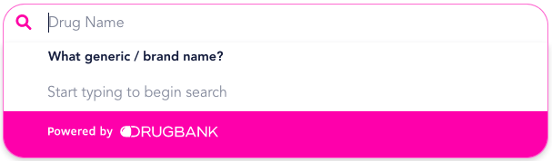
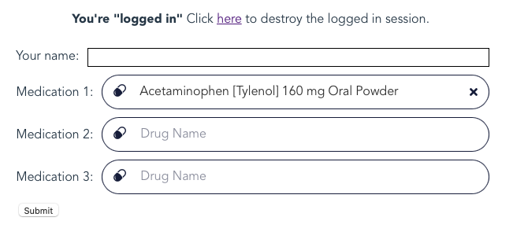

# Medication Search Plugin Technical Implementation Guide



1. Download the _drugbank-ui.min.js_ file [here](https://github.com/omxhealth/clinical-api-plugins/releases).
2. Place it in the same location in your project that other 3rd party javascript files reside.
3. On an HTML page where you want to use it, you will need to load this file before you can use the web component. The web component also has a dependency on VueJS (^2.6.12).

```html
<script src="https://unpkg.com/vue"></script>
<script src="YOUR/JAVASCRIPT/LOCATION/drugbank-ui.min.js"></script>
```

## Basic use

The most basic way you can use our medication search is the following:

```html
<form>
  <db-medication-search name="medication-1" jwt="your-jwt-token"></db-medication-search>
</form>
```

When you submit this form, the DrugBank product concept ID representing your selected medication will be included just like any other input element's, where the parameter name will match the `name` value. In the above example, the selected medication DBPCID would be accessible via the `"medication-1"` parameter in whatever code is processing the form.

## Initializing with an existing value

If you've stored the DBPCID for a previously selected medication, you can initialize the lookup with that by setting the `value` attribute. For example:

```html
<db-medication-search 
  name="medication-1"
  value="DBPC0726274" 
  jwt="your-jwt-token"
></db-medication-search>
```

will initialize the search with "Acetaminophen 100 mg /3mL Oral Liquid".

## Obtaining a JWT

You can find detailed information about generating tokens [in our API docs](https://docs.drugbank.com/v1/#token-authentication).

## Automatic refreshing of JWTs

Javascript Web Tokens allow authenticated access to our API without having to expose your API key. You will still want to limit their lifespan as much as possible to ensure that they are only usable on your site. We recommend creating JWTs that expire in 15 minutes or less for this purpose. While you can generate your JWT and insert it via the `jwt` attribute as part of your page rendering, we also provide another way of keeping your component authenticated with short-lived tokens.

The following sets a path that the component can access to get a refreshed JWT:

```html
<db-medication-search name="medication-1" refresh_jwt="/path/to/refresh"></db-medication-search>
```

The `/path/to/refresh` should exist on your site (e.g. https://your-site.com/path/to/refresh) behind your own authentication/security (eg. cookie/session based logins). The only requirement is that the endpoint returns the JWT as a raw string. The following is an example of an endpoint using the ruby sinatra framework that provides JWTs that last for 15 minutes. You can adapt this to your language/framework of choice.

```ruby
require 'uri'
require 'net/http'

class MockApp < Sinatra::Base
  def refresh_jwt
    uri = URI("https://api.drugbank.com/v1/tokens")
    req = Net::HTTP::Post.new(uri)
    req.body = { ttl: '15m' }.to_json
    req['Content-Type'] = 'application/json'
    req['Authorization'] = 'your-super-secret-api-key'
    req['Cache-Control'] = 'no-cache'
    http = Net::HTTP.new(uri.host, uri.port)
    http.use_ssl = true
    res = http.request(req)
    JSON.parse(res.body)['token']
  end
end
```
<br/>

# Example of Medication Search Plugin Implementation

This provides an example of how to use DrugBank's medication search 
plugin in a real project.

We are writing this in [ruby](https://www.ruby-lang.org/en/), with the 
[sinatra](http://sinatrarb.com) framework, but you can use whatever 
language/framework you like.

## Getting started

[Docker](https://www.docker.com/get-started) is the easiest way to get
this sample application up and running. If you want to set it up without
Docker, the Dockerfile will still be a useful resource to understand the
required software.

If you have Docker installed, you will just need to do some minimal
configuration. Go to the root of your project and run:

```bash
cp config.yml.example config.yml
```

Edit your config.yml to set your DrugBank API key. Then simply run:

```bash
docker-compose up -d sample-app
```

Images will be built if they haven't been built already, and a container will run
to serve the sample application on port 8080. You can change this if you like by 
[editing the docker-compose.yml file](https://docs.docker.com/compose/compose-file/).

## Using the app

Once the app is up and running, go to:

[localhost:8080](http://localhost:8080) in your web browser, and you should see
a screen like this:


Clicking the "here" link will log you in as user 345, and you should see the first
lookup, where we have a preset value now shows a medication ("Acetaminophen [Tylenol]
160 mg Oral Powder"), while the other two are blank.



Enter one or two more medications or change the existing medication if you like, and
click submit.

## Compatibility

The plugins provided here are [Web Components](https://developer.mozilla.org/en-US/docs/Web/Web_Components). They should work in most modern browsers, including: Firefox (as of version 63), Chrome, Opera, Safari, and Edge (as of version 79).