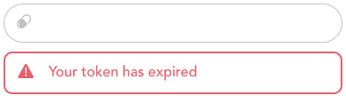
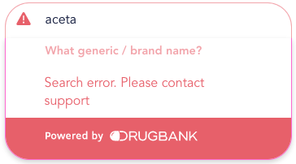

# Medication Search Plugin Technical Implementation Guide


1. Download the _drugbank-ui.min.js_ file [here](https://github.com/omxhealth/clinical-api-plugins/releases). As of v0.2.0, you do not need to include Vue separately.
2. Place it in the same location in your project that other 3rd party javascript files reside.
3. On an HTML page where you want to use it, you will need to load this file before you can use the web component.

```html
<script src="YOUR/JAVASCRIPT/LOCATION/drugbank-ui.min.js"></script>
```

### For v0.1.0

Previous versions of this library had a dependency on VueJS 2.6.12 and required Vue to be loaded separately via:

```html
<script src="https://unpkg.com/vue@2.6.12"></script>
```

Current versions of the library are based on Vue 3.2's new web component support and include an inline version of Vue, so you do not need to load it separately. This will also not conflict with another version of Vue you may have running.

## Basic use

The most basic way you can use our medication search is the following:

```html
<form>
  <db-medication-search name="medication-1" jwt="your-jwt-token"></db-medication-search>
</form>
```

When you submit this form, the DrugBank product concept ID representing your selected medication will be included just like any other input element's, where the parameter name will match the `name` value. In the above example, the selected medication DBPCID would be accessible via the `"medication-1"` parameter in whatever code is processing the form.

## Initializing with an existing value

If you've stored the DBPCID for a previously selected medication, you can initialize the lookup with that by setting the `value` attribute. For example:

```html
<db-medication-search 
  name="medication-1"
  value="DBPC0726274" 
  jwt="your-jwt-token"
></db-medication-search>
```

will initialize the search with "Acetaminophen 100 mg /3mL Oral Liquid".

## Listening to change events

If you are using this in a simple form where you only need to know the value of the medication search upon a POST of the form, then the approach above of looking for the named parameter in the code that processes the form is the simplest way to do it. However, if you need to know the value before form submission, you can listen for updates that are sent with every change to the product concept that's selected.

Here's how you can listen to the component defined above (name="medication-1") via pure Javascript:

```javascript
// Get a reference to the component
medicationSearch = document.getElementsByName("medication-1")[0]

// Attach a listener
medicationSearch.addEventListener("medication-changed", function(e) {
  console.log(e.detail.drugbank_id)
})
```

The above code simply logs the `drugbank_id`. The `medication-changed` event is a `CustomEvent`, and its detail object looks like this:

```json
{
  "drugbank_id": "DBPC1234567"
}
```

The `drugbank_id` will be `null` if nothing is selected or the user clears the selection.

## Customization

There are many optional attributes that can be set on the lookup that corresponds to [Medication Name Search API parameters](https://docs.drugbank.com/v1/#medication-name-search).
### Attributes

- `search-stages`: set the order of stages to narrow down the specified product concept. Possible values include `strengths`, `route`, and `form`, and can be passed as a string or a list. Any stages not specified will be ignored.
- `min-level`: set a level between 1 and 5 that is the minimum product concept level that should be returned.
- `max-level`: set a level between 1 and 5 that is the maximum product concept level that should be returned. It cannot be set below the `min-level`. A warning level log message will be issued and the value will be internally set to `min-level` in this case.
- `level`: set a level between 1 and 5 that is the only level of product concepts to return. If `min-level` and/or `max-level` is set, a warning level log message will be issued. The API will ignore these when `level` is given.
- `min-search-chars`: set the minimum number of characters to enter before making calls to the API. Must be between 1 and 5 (default 3).
- `unbranded`: if true, will exclude all branded product concepts from the search (returns generic entries). This can be useful to decrease the number of similar options returned by the search.
- `region`: set the region(s) to filter on search results. By default, search results will come from any region in a subscription. This can either be a single region (example: `us`) or multiple comma-separated regions (example: `us,ca,it`). See [selecting your region](https://docs.drugbank.com/v1/#selecting-your-region) in the API documentation for all available region codes. Invalid region codes will cause an error when making the subsequent API call. Whenever there is an API error like this, the lookup will change into an error state and indicate an error communicating with the API.


### Custom styling

There are a few aspects of the medication search plugin's style that you can change by setting CSS variables in a containing element:

```css
.containing-class {
  /* Add extra padding to either the lookup or its tags. You cannot add negative padding. */
  --db-lookup-extra-padding-vertical: 10px;
  --db-lookup-extra-padding-horizontal: 20px;
  --db-tag-extra-padding-horizontal: 10px;
  --db-tag-extra-padding-vertical: 10px;
  /* Change the radius of corners on the lookup or its tags. */
  --db-lookup-corner-radius: 5px;
  --db-tag-corner-radius: 10px;
  /* Change the border width around the entire lookup. This cannot be less than 1px. */
  --db-lookup-border-width: 2px;
  /* Change the font used for plugin content. */
  --db-lookup-font-family: courier;
}
```

## Obtaining a JWT

You can find detailed information about generating tokens [in our API docs](https://docs.drugbank.com/v1/#token-authentication).

## Automatic refreshing of JWTs

Javascript Web Tokens allow authenticated access to our API without having to expose your API key. You will still want to limit their lifespan as much as possible to ensure that they are only usable on your site. We recommend creating JWTs that expire in 15 minutes or less for this purpose. While you can generate your JWT and insert it via the `jwt` attribute as part of your page rendering, we also provide another way of keeping your component authenticated with short-lived tokens.

The following sets a path that the component can access to get a refreshed JWT:

```html
<db-medication-search name="medication-1" refresh-jwt="/path/to/refresh"></db-medication-search>
```

The `/path/to/refresh` should exist on your site (e.g. https://your-site.com/path/to/refresh) behind your own authentication/security (eg. cookie/session based logins). The only requirement is that the endpoint returns the JWT as a raw string. The following is an example of an endpoint using the ruby sinatra framework that provides JWTs that last for 15 minutes. You can adapt this to your language/framework of choice.

```ruby
require 'uri'
require 'net/http'

class MockApp < Sinatra::Base
  def refresh-jwt
    uri = URI("https://api.drugbank.com/v1/tokens")
    req = Net::HTTP::Post.new(uri)
    req.body = { ttl: '15m' }.to_json
    req['Content-Type'] = 'application/json'
    req['Authorization'] = 'your-super-secret-api-key'
    req['Cache-Control'] = 'no-cache'
    http = Net::HTTP.new(uri.host, uri.port)
    http.use_ssl = true
    res = http.request(req)
    JSON.parse(res.body)['token']
  end
end
```

By default, the component checks whether the JWT needs to be refreshed every 60 seconds. This can be changed by setting the `refresh-interval` attribute.
<br/>

## Expired JWT Warning

If the JWT expires for any reason, the widget will no longer remain active and will display in light grey along with a prominent error message:



The widget will not be active again until a valid JWT is provided.

## API Errors

Although the widget encapsulates API calls to ensure they are called appropriately, there may still be cases where the underlying call fails. When this happens, the widget will turn red and an error message will appear:



Unlike in the case of an expired JWT, the widget remains active; another successful API call will restore the original widget colours and remove the error text.

## Debug logging

We sometimes log warnings if the widget receives settings that aren't appropriate, even if it can recover from them. However, all logging is turned off by default. A good first step to take if the widget isn't operating as expected is to include the following `meta` tag where you include the `drugbank-ui` script tag:

```html
<meta property="DRUGBANK_UI_LOG_LEVEL" content="info" />
```

We recommend using this when developing. The level can also be set to `'trace'`, `'debug'`, `'warn'`, `'error'`, or `'silent'` (the default).

## CHANGELOG

v0.2.0:
- added ability to override the order of and skip search steps via the `search-stages` attribute
- added "medication-changed" event to make it easy for other Javascript code to capture changes in the component's state
- search string highlighting shows matching portions of results while typing
- added warnings and ability to see them in the browser console with appropriate `meta` tag setting
- added `max-level`, `min-level`, and `level` properties, corresponding to `max_level`, `min_level`, and `level` Medication Name Search API parameters
- added `unbranded` property, allowing searches to focus on unbranded (generic) options
- added `min-search-chars` property to control when the widget starts performing API calls
- added `region` property, corresponding to the parameter of the same name in the Medication Name Search API
- better error state warnings when there are issues with the JWT token or there are search errors due to improper configuration (though we try to prevent these from happening when possible)
- added ability to provide custom styling on lookup and tag corner radius, lookup and tag padding, lookup border width, and lookup font family
- updated the internal Vue library used (to Vue 3) and inline Vue within the package. You no longer need to import Vue separately and it will not conflict with any other versions of Vue you may need on the same page.
- updated all tag attributes to use more conventional dashes instead of underscores (`refresh_jwt` is now `refresh-jwt` and `refresh_interval` is now `refresh-interval`)
- various bug fixes and minor UI improvements

# Example of Medication Search Plugin Implementation

This provides an example of how to use DrugBank's medication search 
plugin in a real project.

We are writing this in [ruby](https://www.ruby-lang.org/en/), with the 
[sinatra](http://sinatrarb.com) framework, but you can use whatever 
language/framework you like.

## Getting started

[Docker](https://www.docker.com/get-started) is the easiest way to get
this sample application up and running. If you want to set it up without
Docker, the Dockerfile will still be a useful resource to understand the
required software.

If you have Docker installed, you will just need to do some minimal
configuration. Go to the root of your project and run:

```bash
cp config.yml.example config.yml
```

Edit your config.yml to set your DrugBank API key. Then simply run:

```bash
docker-compose up -d sample-app
```

Images will be built if they haven't been built already, and a container will run
to serve the sample application on port 8080. You can change this if you like by 
[editing the docker-compose.yml file](https://docs.docker.com/compose/compose-file/).

## Using the app

Once the app is up and running, go to:

[localhost:8080](http://localhost:8080) in your web browser, and you should see
a screen like this:


Clicking the "here" link will log you in as user 345, and you should see the first
lookup, where we have a preset value now shows a medication ("Acetaminophen [Tylenol]
160 mg Oral Powder"), while the other two are blank.


Enter one or two more medications or change the existing medication if you like, and
click submit.

## Compatibility

The plugins provided here are [Web Components](https://developer.mozilla.org/en-US/docs/Web/Web_Components). They should work in most modern browsers, including: Firefox (as of version 63), Chrome, Opera, Safari, and Edge (as of version 79).
